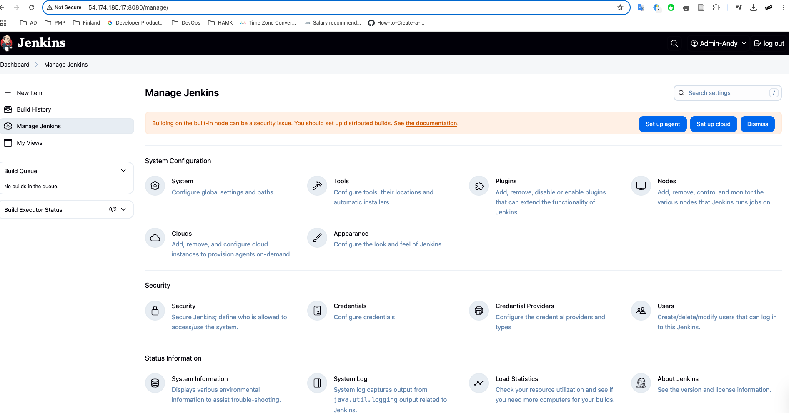
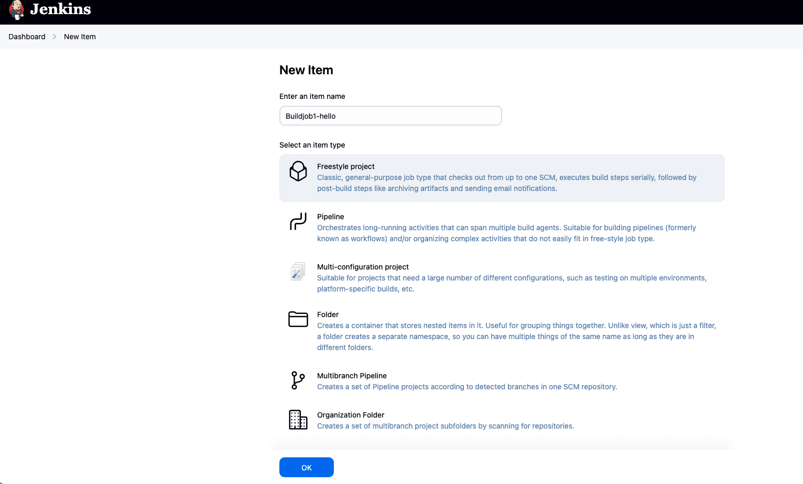
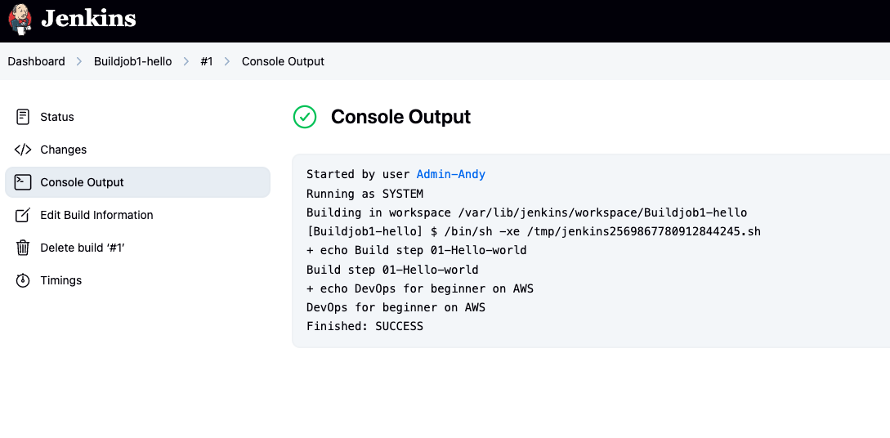
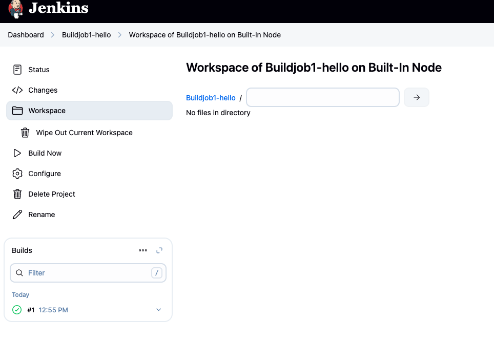

# Lab 1 - Jenkins basic – first hello job.
- Introduce Jenkins interface.
- Create your first Jenkins job, test run it.
- View log & result of job.
- View workplace of job.

## Create EC2 instance with Ubuntu OS 

Following these steps: https://github.com/andylovecloud/DevOps_engineer/tree/main/Jenkins#instructions-for-installing-jenkins-on-ec2-ubuntu

After login you can see the dashboard like below:

 </img>

## Create your first Jenkins job, test run it.

Go to Dashboard -> New items, enter the name:

 </img>

Update the filed **Command** in **Configuration** with below code:
 
 ```
 echo "Build Step 01-Hello world"
 echo "Devops for beginner on AWS"
 ```

Click **Save**

## Build and run test it

After item build, run test and check the result in **Console Output** session if it SUCCESS or not:

 </img>


## View workplace of job

Check again if the job actually created in **Workplace** session:

 </img>
